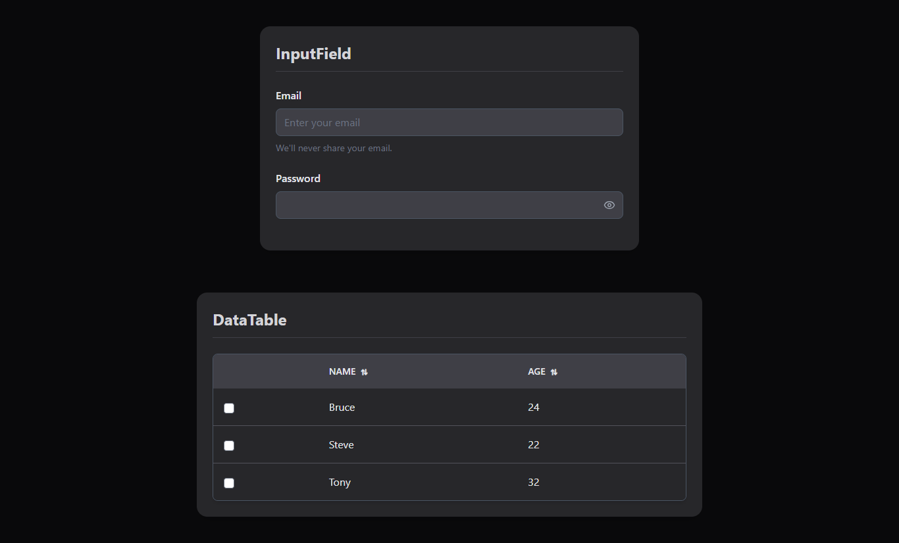

# React UI Components

This repository contains **two reusable React components** built with **TypeScript** and **TailwindCSS**, documented with **Storybook**.  
These components are designed to be flexible, scalable, and easy to integrate into any React project.

---

## Components

### 1. InputField
A flexible input component with validation states, supporting multiple variants, sizes, and optional features.

**Features:**
- Text input with label, placeholder, helper text, and error message  
- States: disabled, invalid, loading  
- Variants: `filled`, `outlined`, `ghost`  
- Sizes: `small`, `medium`, `large`  
- Optional: clear button, password toggle  
- Supports light & dark mode  

**Props:**
```ts
interface InputFieldProps {  
  value?: string;  
  onChange?: (e: React.ChangeEvent<HTMLInputElement>) => void;  
  label?: string;  
  placeholder?: string;  
  helperText?: string;  
  errorMessage?: string;  
  disabled?: boolean;  
  invalid?: boolean;  
  variant?: 'filled' | 'outlined' | 'ghost';  
  size?: 'sm' | 'md' | 'lg';  
}
````


---

### 2. DataTable

A simple, responsive data table with sorting, row selection, loading, and empty states.

**Features:**

* Display tabular data
* Column sorting
* Row selection (single/multiple)
* Loading state
* Empty state

**Props:**

```ts
interface DataTableProps<T> {  
  data: T[];  
  columns: Column<T>[];  
  loading?: boolean;  
  selectable?: boolean;  
  onRowSelect?: (selectedRows: T[]) => void;  
}

interface Column<T> {  
  key: string;  
  title: string;  
  dataIndex: keyof T;  
  sortable?: boolean;  
}
```

The app supports light and dark mode, which automatically adapts to your system’s preferred color scheme.

**Light Mode Screenshot:**


**Dark Mode Screenshot:**


---

🔗 **Live Storybook:** [View the components](http://react-ui-components-sigma.vercel.app/)

---

## Demo Video

Watch the components in action:
[Demo Video Link](https://drive.google.com/drive/folders/1WXkW3uyq8qKZL24avFu_g0w-pvE_bBAo?usp=sharing)

---

## Installation

```bash
# Clone the repository
git clone https://github.com/mansidhote/react-ui-components.git
cd react-ui-components

# Install dependencies
yarn
```

---

## Running the Project

```bash
# Start the React app
yarn dev

# Start Storybook
yarn storybook
```

* **React App:** Shows the components in your main app.
* **Storybook:** Interactive playground with examples and documentation.

---

## Approach & Notes

* **Styling:** TailwindCSS with modern color schemes for light and dark modes.
* **TypeScript:** Fully typed props for type safety and developer convenience.
* **UX:**

  * InputField: consistent spacing for icons and validation messages
  * DataTable: stable sort indicators for better UX
* **Accessibility:** Basic ARIA labels added for inputs and table checkboxes.
* **Storybook:** Documented all components with live examples.

---

## Folder Structure

```
src/
  components/
    InputField/
      InputField.tsx
      InputField.stories.tsx
    DataTable/
      DataTable.tsx
      DataTable.stories.tsx
  App.tsx
  index.tsx
  index.css
assets/
  input-light.png
  input-dark.png
  datatable-light.png
  datatable-dark.png
package.json
README.md
```

---

## Author

Email: [dhotemansi35@gmail.com](mailto:dhotemansi35@gmail.com)
GitHub: [https://github.com/mansidhote](https://github.com/mansidhote)

---

## License

MIT
